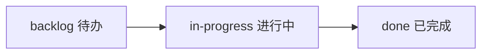

# AI 辅助开发项目结构指南

本文档介绍如何组织项目文件结构，以便 AI 助手（如 Cline）能更好地理解你的代码库并提供有效帮助。

---

## 推荐的目录结构

```
project-root/
├── docs/                      # 项目文档
│   ├── PROJECT_OVERVIEW.md    # 项目概述和架构说明
│   ├── API_REFERENCE.md       # API 接口文档
│   └── DATABASE_SCHEMA.md     # 数据库设计文档
│
├── tasks/                     # 📋 任务管理目录（新增）
│   ├── backlog/               # 待办任务池
│   │   └── TASK-001-add-dark-mode.md
│   ├── in-progress/           # 进行中任务
│   │   └── TASK-002-user-auth.md
│   ├── done/                  # 已完成任务
│   │   └── TASK-001-base-setup.md
│   └── TEMPLATE.md            # 任务模板文件
│
├── frontend/                  # 前端代码目录
│   
├── backend/                   # 后端代码目录
│   
├── config/                    # 配置文件
│   ├── app.config.json        # 应用配置
│   └── build.config.js        # 构建配置
│
├── tests/                     # 测试文件
│   ├── unit/                  # 单元测试
│   └── integration/           # 集成测试
│
├── scripts/                   # 构建/部署脚本
│
├── .cursorrules               # AI 编码规则（Cursor/Cline 专用）
├── README.md                  # 项目入口文档
├── package.json               # 依赖管理
└── tsconfig.json              # TypeScript 配置
```

---

## 📋 任务管理目录详解

### 目录结构说明

| 子目录 | 用途 | 状态标识 |
|--------|------|----------|
| `backlog/` | 已规划但未开始的任务 | ⏳ 待办 |
| `in-progress/` | 当前正在开发的任务 | 🔨 进行中 |
| `done/` | 已完成的任务（含完成日期） | ✅ 已完成 |

### 任务文件命名规范

```
TASK-{编号}-{简短描述}.md

示例:
- TASK-001-add-dark-mode.md
- TASK-002-user-auth.md
- TASK-003-fix-calendar-bug.md
```

### 任务模板 (tasks/TEMPLATE.md)

```markdown
# 任务编号：TASK-XXX

## 任务名称
简短的任务标题

## 状态
- [ ] 待办 (backlog)
- [ ] 进行中 (in-progress)
- [ ] 已完成 (done)

## 优先级
- [ ] P0 - 紧急
- [ ] P1 - 高
- [ ] P2 - 中
- [ ] P3 - 低

## 关联功能模块
- 模块名称：例如 "饮食记录模块 (MoguMogu)"
- 影响范围：前端 / 后端 / 数据库 / 全栈

## 任务描述
详细说明要完成的功能或修复的问题

## 实现计划
- [ ] 步骤 1
- [ ] 步骤 2
- [ ] 步骤 3

## 技术要点
- 关键技术点
- 需要注意的边界情况
- 依赖的外部服务或模块

## 验收标准
- [ ] 功能测试通过
- [ ] 无回归问题
- [ ] 代码符合规范
- [ ] 测试用例已添加

## 相关文件
- 前端：`frontend/src/components/xxx.tsx`
- 后端：`backend/api/xxx.py`
- 数据库：`docs/DATABASE_SCHEMA.md`

## 开发日志
### YYYY-MM-DD
- 完成了 xxx
- 遇到了 xxx 问题，解决方案是 xxx

## 完成情况
- 开始日期：YYYY-MM-DD
- 完成日期：YYYY-MM-DD
- 实际负责人：@username
- 备注：任何额外说明

---
## AI 协作记录
记录与 AI 协作过程中的重要决策和代码变更
```

### 使用工作流



1. **创建任务**: 在 `backlog/` 创建新任务文件
2. **开始开发**: 将文件移动到 `in-progress/`
3. **完成任务**: 将文件移动到 `done/`，更新完成日期

### 快速操作脚本

```bash
# 创建新任务
cp tasks/TEMPLATE.md tasks/backlog/TASK-XXX-description.md

# 开始任务
mv tasks/backlog/TASK-XXX.md tasks/in-progress/

# 完成任务
mv tasks/in-progress/TASK-XXX.md tasks/done/
```

---

## 📝 关键文件说明

### 1. README.md（项目入口）

这是 AI 首先会阅读的文件，应包含：

```markdown
# 项目名称

## 快速开始
- 安装：`npm install`
- 运行：`npm run dev`
- 构建：`npm run build`

## 技术栈
- 前端：React + TypeScript + TailwindCSS
- 后端：Node.js + Express
- 数据库：PostgreSQL

## 目录结构简介
简要描述主要目录用途

## 当前开发进度
查看 `tasks/` 目录了解任务状态
```

### 2. PROJECT_OVERVIEW.md（架构总览）

详细描述系统架构：

```markdown
# 项目架构概览

## 核心功能模块
1. 用户认证模块
2. 数据管理模块
3. 报表生成模块

## 数据流向
描述数据如何在各层之间流动

## 外部依赖
列出所有集成的第三方服务
```

### 3. .cursorrules（AI 行为规则）

创建 `.cursorrules` 文件指导 AI 的行为：

```
# 项目编码规范

## 代码风格
- 使用 TypeScript 严格模式
- 优先使用函数式编程
- 组件使用箭头函数语法

## 命名约定
- 变量：camelCase
- 组件：PascalCase
- 常量：UPPER_SNAKE_CASE

## AI 响应要求
- 解释代码变更原因
- 保持向后兼容
- 添加必要的错误处理
```

---

## 🔍 让 AI 理解代码的最佳实践

### 1. 清晰的模块边界

```typescript
// ✅ 好的做法 - 单一职责
export class UserService {
  // 只处理用户相关业务逻辑
}

export class EmailService {
  // 只处理邮件发送逻辑
}
```

### 2. 详细的类型定义

```typescript
// ✅ 为 AI 提供完整的上下文
interface UserContext {
  userId: string;
  permissions: Permission[];
  sessionExpiry: Date;
}
```

### 3. 自描述的函数名

```typescript
// ❌ 不清晰
function handle(data: any) {}

// ✅ 清晰明了
async function validateUserPermissions(userId: string): Promise<boolean> {}
```

---

## 💡 与 AI 高效协作的技巧

### 1. 任务分解

将大需求拆分为小任务：

```
❌ "实现用户管理系统"
✅ 
  - [ ] 创建 User 模型
  - [ ] 实现注册 API
  - [ ] 实现登录验证
  - [ ] 添加密码加密
```

### 2. 提供充分上下文

当请求修改时，告诉 AI：
- 当前问题是什么
- 期望达到的效果
- 相关文件的依赖关系
- **引用任务文件**: `参考 tasks/in-progress/TASK-XXX.md`

### 3. 增量确认

对于复杂改动：
```
请先实现核心逻辑 → 我确认后再添加错误处理 → 最后补充测试
```

### 4. 任务驱动开发

```markdown
## 与 AI 协作时引用任务

"根据 tasks/in-progress/TASK-002-user-auth.md 的实现计划，
请帮我完成步骤 1：创建 User 模型"

"参考 TASK-002 的技术要点，实现注册 API 时需要注意..."
```

---

## 🚀 快速启动清单

新项目初始化步骤：

- [ ] 创建基础目录结构
- [ ] 编写 README.md 说明项目目标
- [ ] 创建 `.cursorrules` 定义编码规范
- [ ] 初始化版本控制
- [ ] 配置开发环境
- [ ] **创建 `tasks/` 目录结构**
- [ ] **复制 `TEMPLATE.md` 到 `tasks/`**
- [ ] **创建第一个任务到 `tasks/backlog/`**

---

## 📊 任务状态快速查看

```bash
# 查看所有待办任务
ls -1 tasks/backlog/

# 查看进行中任务
ls -1 tasks/in-progress/

# 统计任务数量
echo "待办：$(ls tasks/backlog/ | wc -l)"
echo "进行中：$(ls tasks/in-progress/ | wc -l)"
echo "已完成：$(ls tasks/done/ | wc -l)"
```

---

## 📚 进阶资源

- [Cline 官方文档](https://docs.cline.bot/)
- [Cursor IDE 最佳实践](https://docs.cursor.com/)
- [AI Pair Programming Patterns](https://example.com)
- [Kanban 方法介绍](https://kanbanzip.com/kanban-what-is-kanban/)

---

**提示**: 良好的项目结构和文档是 AI 理解你意图的关键。花时间在前期建立清晰的架构，会让后续的 AI 协作事半功倍！

**任务管理提示**: 使用 `tasks/` 目录可以让 AI 更好地理解当前开发重点，提供更有针对性的帮助。每次与 AI 协作时，可以引用相关任务文件作为上下文。